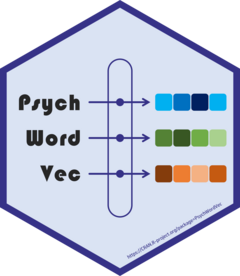

# PsychWordVec <a href="https://psychbruce.github.io/PsychWordVec/"></a>

Word Embedding Research Framework for Psychological Science.

An integrated toolbox of word embedding research that provides:

1.  A collection of [pre-trained static word vectors](https://psychbruce.github.io/WordVector_RData.pdf) in the .RData compressed format;
2.  A series of functions to process, analyze, and visualize word vectors;
3.  A range of tests to examine conceptual associations, including the *Word Embedding Association Test* (Caliskan et al., 2017) and the *Relative Norm Distance* (Garg et al., 2018), with permutation test of significance;
4.  A set of training methods to locally train (*static*) word vectors from text corpora, including *Word2Vec* (Mikolov et al., 2013), *GloVe* (Pennington et al., 2014), and *FastText* (Bojanowski et al., 2017);
5.  A group of functions to download pre-trained language models (e.g., *GPT*, *BERT*), extract contextualized (*dynamic*) word vectors (based on the R package [text](https://www.r-text.org/)), and perform language analysis tasks (e.g., fill in the blank masks).

<!-- badges: start -->

[](https://CRAN.R-project.org/package=PsychWordVec) [](https://github.com/psychbruce/PsychWordVec) [](https://github.com/psychbruce/PsychWordVec/actions) [](https://CRAN.R-project.org/package=PsychWordVec) [](https://github.com/psychbruce/PsychWordVec/stargazers)

<!-- badges: end -->


## Author

Han-Wu-Shuang (Bruce) Bao 包寒吴霜

Email: [baohws\@foxmail.com](mailto:baohws@foxmail.com)

Homepage: [psychbruce.github.io](https://psychbruce.github.io)

## Citation

-   Bao, H.-W.-S. (2022). PsychWordVec: Word embedding research framework for psychological science. R package version 0.2.x. <https://CRAN.R-project.org/package=PsychWordVec>

## Installation

``` r
## Method 1: Install from CRAN
install.packages("PsychWordVec")

## Method 2: Install from GitHub
install.packages("devtools")
devtools::install_github("psychbruce/PsychWordVec", force=TRUE)
```

## Functions in `PsychWordVec`

-   Word Embeddings Data Management and Transformation
    -   `as_embed()`: from `wordvec` (data.table) to `embed` (matrix)
    -   `as_wordvec()`: from `embed` (matrix) to `wordvec` (data.table)
    -   `data_transform()`: transform plain text word vectors to `wordvec` or `embed`
    -   `data_wordvec_load()`: load transformed .RData file
-   Word Vectors Extraction, Linear Operation, and Visualization
    -   `subset()`: extract a subset of `wordvec` and `embed`
    -   `normalize()`: normalize all word vectors to the unit length 1
    -   `get_wordvec()`
    -   `sum_wordvec()`
    -   `plot_wordvec()`
    -   `plot_wordvec_tSNE()`: 2D or 3D visualization with t-SNE
    -   `orth_procrustes()`: Orthogonal Procrustes matrix alignment
-   Word Semantic Similarity Analysis and Conceptual Association Test
    -   `cosine_similarity()`
        -   `cos_sim()`
        -   `cos_dist()`
    -   `pair_similarity()`
    -   `plot_similarity()`
    -   `tab_similarity()`
    -   `most_similar()`: find the Top-N most similar words
    -   `test_WEAT()`: WEAT and SC-WEAT with permutation test of significance
    -   `test_RND()`: RND with permutation test of significance
-   Dictionary Automatic Expansion and Reliability Analysis
    -   `dict_expand()`: expand a dictionary from the most similar words
    -   `dict_reliability()`: reliability analysis and PCA of a dictionary
-   Word Vectors Local Training (Word2Vec, GloVe, and FastText)
    -   `tokenize()`
    -   `train_wordvec()`
-   Pre-trained Language Models (PLM) and Contextualized Word Embeddings
    -   `text_init()`: set up a Python environment for PLM
    -   `text_model_download()`: download PLMs from [HuggingFace](https://huggingface.co/models) to local ".cache" folder
    -   `text_model_remove()`: remove PLMs from local ".cache" folder
    -   `text_to_vec()`: extract contextualized token and text embeddings
    -   `text_unmask()`: fill in the blank mask(s) in a query

See the documentation (help pages) for their usage and details.
